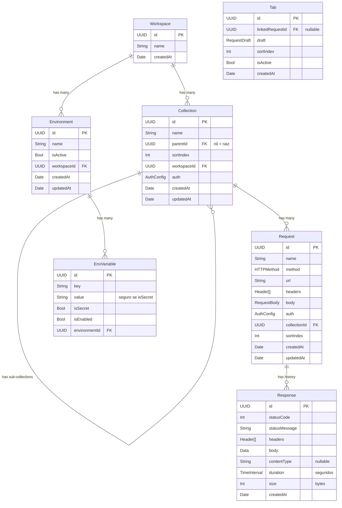

# Appi — Data Model

> Diagrama de entidades e relacionamentos  
> Ver também: `domain.md` (definição completa), `architecture.md` (mapeamento domain ↔ @Model)

---

## 1. Diagrama de entidades (ERD)



---

## 2. Relacionamentos e cardinalidade

| Pai | Filho | Cardinalidade | Cascade delete |
|---|---|---|---|
| Workspace | Collection | 1:N | Sim — remove collections, sub-collections, requests, responses |
| Workspace | Environment | 1:N | Sim — remove environments e variáveis |
| Collection | Collection (sub) | 1:N (auto-ref) | Sim — remove toda a sub-árvore |
| Collection | Request | 1:N | Sim — remove requests e suas responses |
| Request | Response | 1:N (max 50) | Sim — limite gerenciado pelo ResponseRepository |
| Environment | EnvVariable | 1:N | Sim |
| Tab | Request | N:1 (opcional) | Não — tab vira órfã (linkedRequestId = nil) |

---

## 3. Mapeamento Domain ↔ SwiftData

Cada entidade existe em duas formas:

| Domain (struct pura) | Data (@Model class) | Conversão |
|---|---|---|
| `Workspace` | `WorkspaceModel` | `toDomain()` / `init(from:)` |
| `Collection` | `CollectionModel` | `toDomain()` / `init(from:)` |
| `Request` | `RequestModel` | `toDomain()` / `init(from:)` |
| `Response` | `ResponseModel` | `toDomain()` / `init(from:)` |
| `Environment` | `EnvironmentModel` | `toDomain()` / `init(from:)` |
| `EnvVariable` | `EnvVariableModel` | `toDomain()` / `init(from:)` |
| `Tab` | `TabModel` | `toDomain()` / `init(from:)` |

> **Nota:** `ResponseModel` tem `requestId: UUID` para o vínculo com request. A struct `Response` de domínio não carrega esse campo — o vínculo é responsabilidade do repository.

Value objects (`Header`, `FormField`, `RequestBody`, `AuthConfig`, etc.) são `Codable` — armazenados como JSON transformável nos @Model classes.

---

## 4. Constraints e invariantes

| Entidade | Constraint | Garantida por |
|---|---|---|
| Environment | Max 1 ativo por workspace | `EnvironmentRepository.activate()` |
| Response | Max 50 por request | `ResponseRepository.save()` |
| Collection | Max 5 níveis de profundidade | Validação em `CollectionRepository.save()` |
| EnvVariable | Key única por environment (case-sensitive) | `EnvironmentRepository.save()` |
| Collection raiz | `auth` nunca é `.inheritFromParent` | Validação em `CollectionRepository.save()` + UI |
| Tab | Apenas 1 `isActive = true` | `TabRepository.save()` |

---

## 5. Fluxo de dados por operação

### Criar request
```
UI → RequestEditorViewModel.save()
   → draft.toRequest() → Request (struct)
   → RequestRepository.save(request)
   → SwiftDataRequestRepository: Request → RequestModel → context.insert → context.save
   → tab.linkedRequestId = request.id
```

### Executar request
```
UI → RequestEditorViewModel.send(environment: activeEnvironment)
   → EnvironmentViewModel fornece o environment ativo (único com isActive = true)
   → EnvResolver.resolve(draft, using: activeEnvironment) → PreparedRequest
     (substitui {{vars}} com variáveis habilitadas do environment, valida URL)
   → CollectionRepository.ancestorChain(for: collectionId) → [Collection]
   → AuthResolver.resolve(for: draft.auth, chain: collections) → ResolvedAuth
     (para OAuth2: carrega token do Keychain, faz refresh se expirado)
   → PreparedRequest.withAuth(auth) → ResolvedRequest
   → HTTPClient.execute(resolved) → Response (struct, sem requestId)
   → Se tab.linkedRequestId existe:
     → ResponseRepository.save(response, forRequestId: linkedRequestId)
     → SwiftDataResponseRepository: Response → ResponseModel(requestId) → context.insert
     → Prune: se count > 50, remove mais antigos
   → Se tab.linkedRequestId == nil (draft não salvo):
     → Response exibida no viewer, mas não persistida no histórico
```

### Deletar collection
```
UI → CollectionTreeViewModel.delete(collection)
   → CollectionRepository.delete(collection)
   → SwiftDataCollectionRepository:
     1. Fetch sub-collections descendentes (recursivo)
     2. Fetch requests de todas as collections
     3. Fetch responses de todos os requests
     4. Delete tudo (bottom-up)
   → TabRepository.cleanupOrphanedLinks()
     → Tabs com linkedRequestId apontando para requests deletados → linkedRequestId = nil
```

---

*Ver também: `domain.md`, `architecture.md`*
